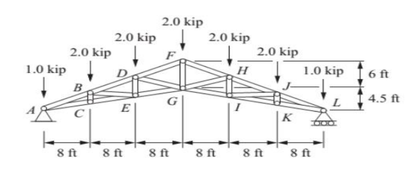
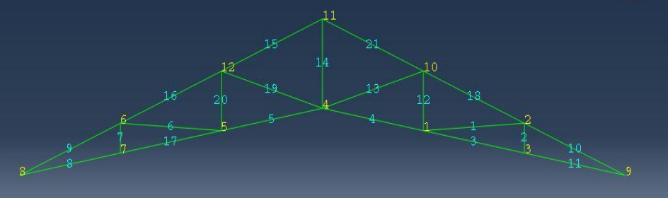
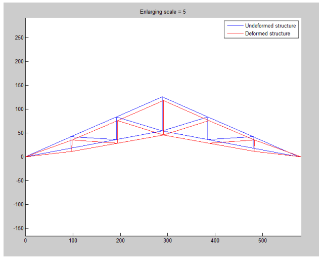

# FEM-analysis-of-Truss-structures-using-Matlab

This **MATLAB** toolbox can be used to solve complex 2D truss structures using finite element analysis. It reads the question inputs from an excel file.

It takes three types of **boundary condition** into account.
* Fixed boundary condition with **zero displacement** of a node for each direction.
* **Non-zero** transformation of nodes in each direction.
* Boundary conditions with an **angle** with the horizon.

It also accepts both **concentrate forces** on nodes and **thermal forces** on elements.
  
## Model Input
Structure’s data (nodes' position, elements, material characteristics, forces, and boundary conditions) are fed to model by an Excel file.
**Explaining excel input file:**
The excel file has seven pages.
* **Nodes page**: The first column is node index and second and third columns are x and y position of nodes, respectively.
* **Elements page**: The first column is the number of nodes in the element, which is 2 for truss elements. Other columns are the index of nodes in this element.
* **Material page**: The first column is element index and others are area, elasticity coefficient, and thermal linear expansion coefficient. 
* **AngleBC page**: It is for **Ramp Boundary Condition**. The first column is the node number that is on a ramp and the second column is the ramp angle.
* **BC page**: it is for **Boundary Condition**. The first column is the index of degree of freedom in the **Global displacement vector**. For example if it is 6, it means that the third node is limited in the y direction. The second column is the displacement of constrained degree of freedom.
* **Force page**: It is the amount of concentrated force on each degree of freedom. Like BC matrix, its size is same as Global displacement vector.
* **thermal page**: The first column is element index and second column is the temperature difference of element.

## How to use it
After making excel input file form the structure just call solveTruss(ExcelPath) function. 'ExcelPath' is the path to your excel file as string.
If the excel file is in the same directory as the solveTruss.m file just write excel file name like solveTruss('Truss.xlsx').
## Example
We have a truss structure under load as follow:

    

The nodes are indexed in this way:

    

The input file is <a href="https://github.com/emadfrj/FEM-analysis-of-Truss-structures-using-Matlab/blob/main/Truss.xlsx">Truss.xlsx</a> 

By calling solveTruss function (solveTruss('Truss.xlsx')) we would have the results like the following picture.

    

